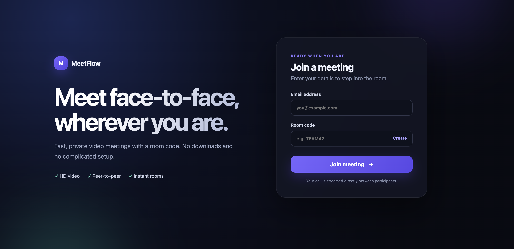
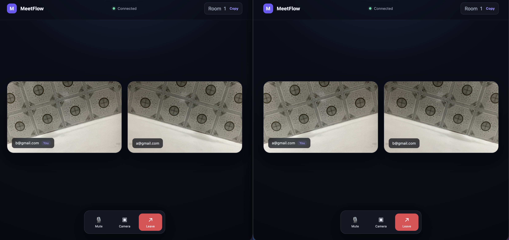
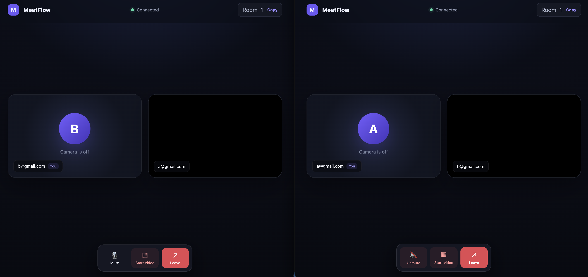
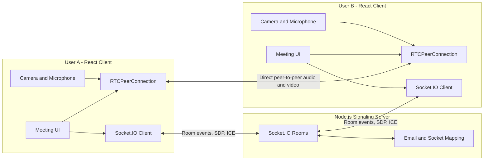

# MeetFlow

MeetFlow is a browser-based, one-to-one video meeting application built with React, WebRTC, and Socket.IO. Users join with an email address and room code, then communicate through a direct peer-to-peer audio/video connection.

## Screenshots

### Join a meeting



### Video call



### Meeting controls



## Features

- Join or create a meeting using a room code
- Peer-to-peer audio and video through WebRTC
- Real-time signaling with Socket.IO
- Microphone mute and unmute controls
- Camera start and stop controls
- Live connection and participant status
- Copyable room codes
- Responsive interface for desktop and mobile screens

## Technology Stack

### Frontend

- **React 19** for the user interface and component state
- **React Router** for home and room navigation
- **Socket.IO Client** for signaling events
- **WebRTC APIs** (`RTCPeerConnection` and `getUserMedia`) for peer-to-peer media
- **CSS** for the responsive interface, animations, and meeting layout

### Backend

- **Node.js** as the server runtime
- **Express** for the HTTP server
- **Socket.IO** for rooms, SDP offer/answer exchange, and ICE candidate relay
- **Nodemon** for automatic server restarts during development

## Architecture



The Socket.IO server is used only for connection setup. It relays room events, WebRTC offers and answers, and ICE candidates. After negotiation succeeds, audio and video travel directly between the two browsers.

## Call Flow

1. Both users enter the same room code.
2. The signaling server places their sockets in the same room.
3. The existing participant receives a `user-joined` event and creates a WebRTC offer.
4. The second participant applies the offer and sends an answer.
5. Both clients exchange ICE candidates through Socket.IO.
6. WebRTC establishes a direct media connection between the browsers.

## Project Structure

```text
MeetFlow-WebRTC-zoomClone/
├── client/
│   ├── public/
│   └── src/
│       ├── components/       # Header, video tile, and call controls
│       ├── pages/            # Home and meeting room screens
│       ├── providers/        # Socket.IO and WebRTC providers
│       ├── App.js
│       └── index.js
├── images/                   # README screenshots
├── server/
│   └── index.js              # Express and Socket.IO signaling server
└── README.md
```

## Getting Started

### Requirements

- Node.js 18 or newer
- npm
- A modern browser with camera and microphone support

### 1. Clone the repository

```bash
git clone https://github.com/mazizullah01/MeetFlow-WebRTC-zoomClone.git
cd MeetFlow-WebRTC-zoomClone
```

### 2. Install server dependencies

```bash
cd server
npm install
```

### 3. Install client dependencies

```bash
cd ../client
npm install
```

### 4. Start the signaling server

Open a terminal in the project directory:

```bash
cd server
npm start
```

The Express server runs on port `4000`, and Socket.IO listens on port `4001`.

### 5. Start the React client

Open a second terminal:

```bash
cd client
npm start
```

Open [http://localhost:3000](http://localhost:3000) in your browser.

## Testing a Call Locally

1. Open the application in two separate browser windows or profiles.
2. Enter a different email address in each window.
3. Enter the same room code in both windows.
4. Allow camera and microphone permissions when requested.
5. The users should connect and see each other's video streams.

## Production Notes

- Camera and microphone access requires HTTPS outside `localhost`.
- The included public STUN servers help peers discover network addresses.
- A production deployment should add a TURN server for users behind restrictive NATs or firewalls.
- Replace the hard-coded Socket.IO URL in `client/src/providers/socket.jsx` with an environment variable before deployment.
- Add authentication and room authorization before using the application with sensitive meetings.

## Contact

Created by **Azizullah**  
Email: [m.azizullah420@gmail.com](mailto:m.azizullah420@gmail.com)
